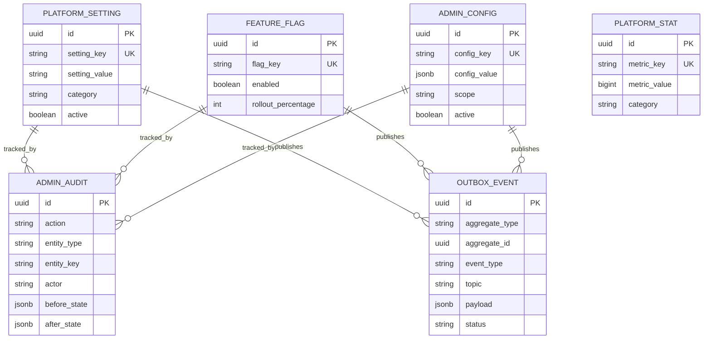
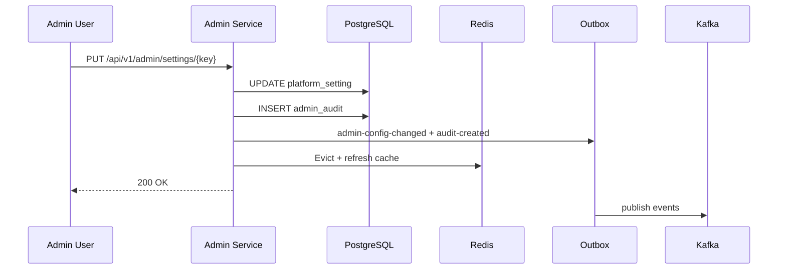

# Admin Service Architecture

## ER Diagram

## Sequence Diagram — Setting Update

## Integration

| Event | Topic | Consumers |
|-------|-------|-----------|
| Config changed | `admin-config-changed` | Gateway, domain services |
| Feature toggled | `admin-feature-toggled` | AI Service, Product Service |
| Audit created | `audit-created` | Audit Service |

All mutations write to `admin_audit` locally and enqueue `audit-created` for the central audit trail.

## Dashboard

The `/api/v1/admin/dashboard` endpoint aggregates:

- **Domain summaries** — total/active counts for settings, feature flags, and configs
- **Admin audit total** — count of local admin audit records
- **Platform metrics** — seeded `platform_stat` rows (subscriptions, reports, users, products, sellers, buyers)

Metrics are stored in the admin database and can be updated by future sync jobs from domain services.

## Security

| Operation | Roles |
|-----------|-------|
| All `/api/v1/admin/**` | ADMIN only |
| Bootstrap `/api/v1/bootstrap/**` | Public |
| Actuator `/actuator/**` | Public |

JWT validation uses Keycloak realm roles with `ROLE_` prefix mapping.

## Caching

Redis caches:

- Individual settings by key
- Full settings list
- Individual feature flags by key
- Full feature flags list

Cache TTL defaults to 3600 seconds (`ADMIN_CACHE_TTL_SECONDS`). Mutations evict affected keys.

## Outbox Pattern

Transactional outbox ensures Kafka events are published reliably:

1. Business transaction commits setting/flag/config + audit + outbox row
2. Scheduled publisher polls `PENDING` outbox events every 5 seconds
3. Failed publishes retry up to 5 times, then move to `admin-dead-letter`
