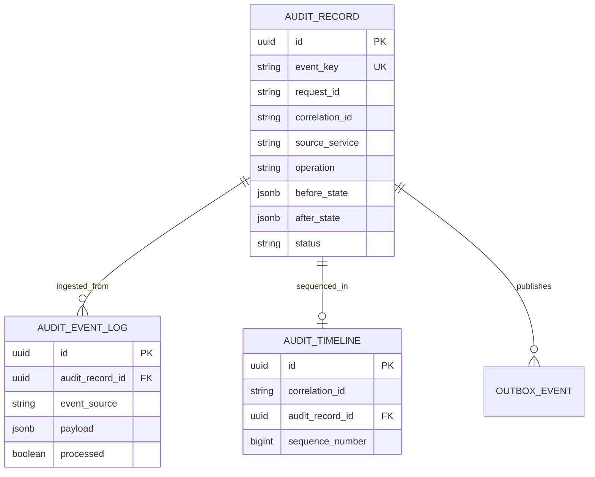
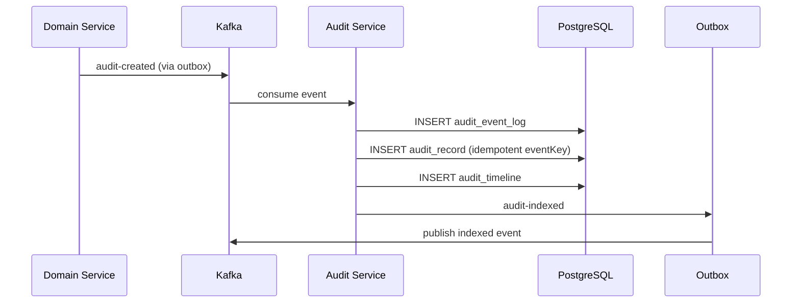

# Audit Service Architecture

## ER Diagram

## Sequence Diagram — Kafka Ingestion

## Integration

| Source Service | Topic | Payload Fields |
|----------------|-------|----------------|
| Workflow Service | `audit-created` | workflowId, requestId, correlationId, operation, status, actor |
| Notification Service | `audit-created` | notificationId, requestId, operation, status |
| Product Service | `audit-created` | productId, requestId, operation |

All services publish audit events via transactional outbox. Audit Service is the single source of truth for cross-service audit queries.

## Security

| Operation | Roles |
|-----------|-------|
| GET (search/read) | ADMIN, SELLER |
| POST (create) | ADMIN, SELLER |
| DELETE (archive) | ADMIN only |

Audit records are immutable — no UPDATE endpoint. Archive is a soft-delete for compliance retention policies.
