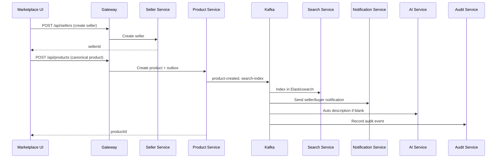

# Enterprise Marketplace — End-to-End Testing Guide

This document explains how to run the full B2B marketplace platform, use the **Marketplace UI** frontend to test every microservice, and verify the complete event-driven flow from seller onboarding to buyer search and AI assistance.

---

## Architecture Overview

```
┌─────────────────┐     ┌──────────────────┐     ┌─────────────────────────────┐
│  Marketplace UI │────▶│  API Gateway     │────▶│  Microservices (8081–8095)  │
│  (React, 5173)  │     │  (8080)          │     │  Product, Seller, Buyer…    │
└─────────────────┘     └────────┬─────────┘     └──────────────┬──────────────┘
                                 │                               │
                                 │                    ┌──────────▼──────────┐
                                 │                    │  Kafka Event Bus      │
                                 │                    │  (product-created,    │
                                 │                    │   search-index, etc.) │
                                 │                    └──────────┬──────────┘
                                 │                               │
                    ┌────────────▼────────────┐       ┌──────────▼──────────┐
                    │  Keycloak (8180)        │       │  Search (ES), AI,   │
                    │  JWT when enabled       │       │  Notification, Audit│
                    └─────────────────────────┘       └─────────────────────┘
```

---

## Prerequisites

| Tool | Version |
|------|---------|
| JDK | 21 |
| Maven | 3.9+ |
| Node.js | 20+ |
| Docker Desktop | Latest |

---

## Step 1 — Start Infrastructure

```powershell
cd docker
cp .env.example .env
docker compose up -d
```

This starts: PostgreSQL/Neon-compatible DBs, Redis, Kafka, Elasticsearch, Keycloak, Ollama, Prometheus, Grafana.

Verify:

```text
GET http://localhost:8080/actuator/health
GET http://localhost:8091/api/v1/infrastructure/health/ollama
GET http://localhost:8090/api/v1/infrastructure/health/elasticsearch
```

---

## Step 2 — Start Backend Services

### Recommended for UI testing (security off)

Run gateway with JWT validation disabled:

```powershell
cd gateway-service
$env:MARKETPLACE_SECURITY_ENABLED="false"
mvn spring-boot:run
```

Run each microservice with standalone profile (H2/in-memory, no external deps):

```powershell
cd product-service
mvn spring-boot:run "-Dspring-boot.run.profiles=local,standalone"
```

Repeat for: `seller-service`, `buyer-service`, `category-service`, `inventory-service`, `pricing-service`, `workflow-service`, `notification-service`, `search-service`, `ai-service`, `audit-service`, `subscription-service`, `report-service`, `admin-service`.

### Production-like mode (with Docker infra)

Omit `standalone` profile and ensure Neon DB URLs, Kafka, and Redis are configured in each service's `application-local.yml`.

---

## Step 3 — Start Frontend

```powershell
cd frontend
npm install
npm run dev
```

Open **http://localhost:5173**

The UI proxies API calls to the gateway at `http://localhost:8080`.

---

## Step 4 — Gateway Route Map

All frontend calls use this pattern:

```text
http://localhost:8080{gatewayPrefix}{serviceApiPath}
```

| Service | Gateway Prefix | Example |
|---------|----------------|---------|
| Product | `/api/products` | `/api/products/api/v1/products` |
| Seller | `/api/sellers` | `/api/sellers/api/v1/sellers` |
| Buyer | `/api/buyers` | `/api/buyers/api/v1/buyers` |
| Category | `/api/categories` | `/api/categories/api/v1/categories` |
| Inventory | `/api/inventory` | `/api/inventory/api/v1/inventory` |
| Pricing | `/api/pricing` | `/api/pricing/api/v1/pricing` |
| Workflow | `/api/workflows` | `/api/workflows/api/v1/workflows` |
| Notification | `/api/notifications` | `/api/notifications/api/v1/notifications` |
| Search | `/api/search` | `/api/search/api/v1/search/products?q=steel` |
| AI | `/api/ai` | `/api/ai/api/v1/ai/chat` |
| Audit | `/api/audits` | `/api/audits/api/v1/audits` |
| Subscription | `/api/subscriptions` | `/api/subscriptions/api/v1/subscriptions` |
| Report | `/api/reports` | `/api/reports/api/v1/reports` |
| Admin | `/api/admin` | `/api/admin/api/v1/admin/dashboard` |

---

## Step 5 — End-to-End Business Flow

Use the **E2E Flow** page in the UI (`/e2e`) or follow manually:

### Flow A — Seller publishes product



| Step | Action | Service | UI Page |
|------|--------|---------|---------|
| 1 | Create Seller | Seller (8083) | E2E / Catalog |
| 2 | Create Category | Category (8085) | E2E / Catalog |
| 3 | Create Buyer | Buyer (8084) | E2E / Marketplace |
| 4 | Create Product (canonical) | Product (8082) | E2E / Catalog |
| 5 | Search products | Search (8090) | E2E / Marketplace |
| 6 | AI chat + interpret | AI (8091) | E2E / Marketplace |
| 7 | Verify side effects | Notification, Workflow, Audit | E2E / Platform |

### Flow B — Product creation side effects

When a product is created, Product Service publishes Kafka events via transactional outbox:

| Event | Consumer Services |
|-------|-------------------|
| `product-created` | Notification, Workflow, Audit, Report, Search, AI |
| `search-index` | Search (Elasticsearch), AI (product cache) |
| `workflow-updated` | Workflow Service |
| `notification-created` | Notification Service |
| `audit-created` | Audit Service |

**Verification (Platform page):**

1. **Notifications** — `GET /api/notifications/api/v1/notifications`
2. **Workflows** — `GET /api/workflows/api/v1/workflows`
3. **Audits** — `GET /api/audits/api/v1/audits`

> Note: Async indexing may take a few seconds. Retry search if the product is not yet indexed.

### Flow C — Buyer discovery

| Step | Action | API |
|------|--------|-----|
| 1 | Natural language query | `POST /api/ai/api/v1/ai/search/interpret` |
| 2 | Elasticsearch search | `GET /api/search/api/v1/search/products?q=steel` |
| 3 | AI assistant chat | `POST /api/ai/api/v1/ai/chat` |
| 4 | Recommendations | `GET /api/ai/api/v1/ai/recommendations?buyerId=...` |

### Flow D — Platform administration

| Step | Action | API |
|------|--------|-----|
| 1 | Admin dashboard | `GET /api/admin/api/v1/admin/dashboard` |
| 2 | Toggle AI feature | Admin publishes `admin-feature-toggled` → AI Service |
| 3 | Subscription plans | `GET /api/subscriptions/api/v1/subscriptions` |
| 4 | Reports | `GET /api/reports/api/v1/reports` |

---

## Step 6 — UI Pages Reference

### Dashboard (`/`)

- Pings bootstrap health for all 14 microservices through the gateway
- Shows UP/DOWN status and latency

### E2E Flow (`/e2e`)

- Guided 7-step wizard with stored context (sellerId, buyerId, productId)
- **Run All Remaining** executes the full journey automatically
- JSON response panel for each step

### Catalog (`/catalog`)

- Create/list: Seller, Category, Product, Inventory, Pricing

### Marketplace (`/marketplace`)

- Buyer CRUD, Elasticsearch search, AI interpret + chat

### Platform (`/platform`)

- Workflow, Notification, Audit, Subscription, Report, Admin dashboard

---

## Step 7 — Authentication

### Without JWT (local dev)

Set on gateway and each service:

```yaml
marketplace:
  security:
    enabled: false
```

Leave the JWT field empty in the UI sidebar.

### With Keycloak JWT

1. Start Keycloak (Docker)
2. Obtain token from realm `marketplace`
3. Paste Bearer token in UI sidebar
4. Gateway validates JWT on all routes except `/actuator/**` and `/api/v1/bootstrap/**`

---

## Step 8 — Troubleshooting

| Issue | Fix |
|-------|-----|
| All services DOWN on Dashboard | Start gateway on port 8080; ensure services are running |
| 401 Unauthorized | Disable security or paste valid JWT |
| 400 on product create | Ensure `Idempotency-Key` header (UI adds automatically) |
| Search returns empty | Wait for Kafka indexing; check search-service logs |
| AI chat fails | Start Ollama: `docker compose up -d ollama` |
| CORS errors | Use Vite dev server proxy (default); do not call services directly from browser |

---

## Step 9 — Share This Document

Share with QA/stakeholders:

1. This guide: `docs/end-to-end-testing-guide.md`
2. Frontend README: `frontend/README.md`
3. Postman collections: `docs/postman/*.postman_collection.json`
4. Service-specific READMEs: `{service}/README.md`

---

## Quick Verification Checklist

- [ ] Docker infrastructure running
- [ ] Gateway running on 8080
- [ ] At least Product, Seller, Buyer, Category, Search, AI, Notification services UP
- [ ] Frontend running on 5173
- [ ] Dashboard shows services UP
- [ ] E2E Flow completes all 7 steps
- [ ] Search returns created product
- [ ] Notifications/Workflows/Audits populated after product create

---

## Related Documentation

- [Product Service Architecture](product-service-architecture.md)
- [Search Service Architecture](search-service-architecture.md)
- [AI Service Architecture](ai-service-architecture.md)
- [Notification Service Architecture](notification-service-architecture.md)
- [Folder Structure](folder-structure.md)
