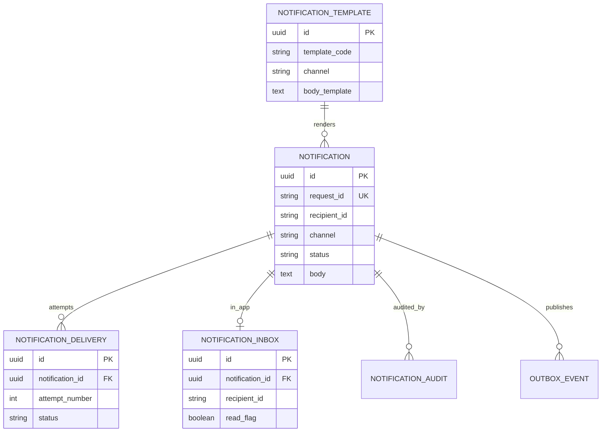
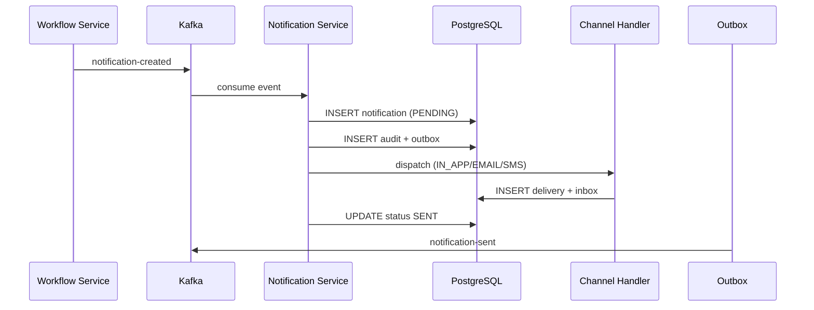
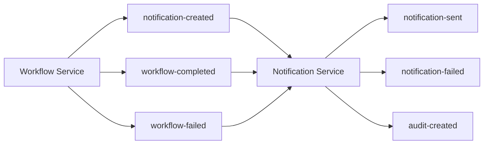

# Notification Service Architecture

## ER Diagram

## Sequence Diagram — Kafka to Delivery

## Kafka Event Flow

## Channel Handlers

| Channel | Handler | Delivery Mechanism |
|---------|---------|-------------------|
| IN_APP | InAppChannelHandler | Persists to `notification_inbox` |
| EMAIL | EmailChannelHandler | JavaMailSender (SMTP) |
| SMS | SmsChannelHandler | HTTP gateway (`SMS_GATEWAY_URL`) |
| PUSH | PushChannelHandler | HTTP gateway (`PUSH_GATEWAY_URL`) |
| WEBHOOK | WebhookChannelHandler | POST to `recipientAddress` |

## Integration

| Service | Direction | Topic |
|---------|-----------|-------|
| Workflow Service | → Notification | `notification-created`, `workflow-completed`, `workflow-failed` |
| Audit Service | Notification → | `audit-created` |

All integration is event-driven via Kafka. No cross-service database access.
