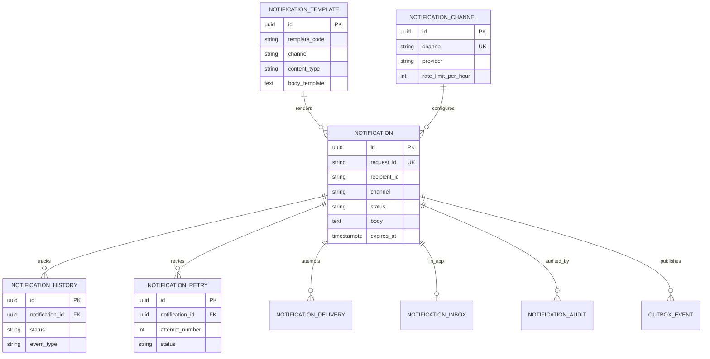
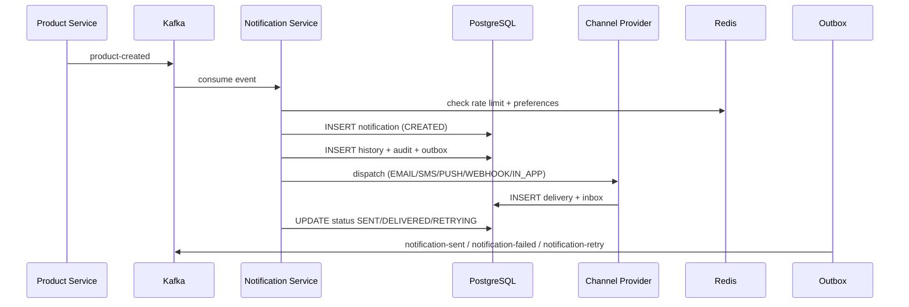
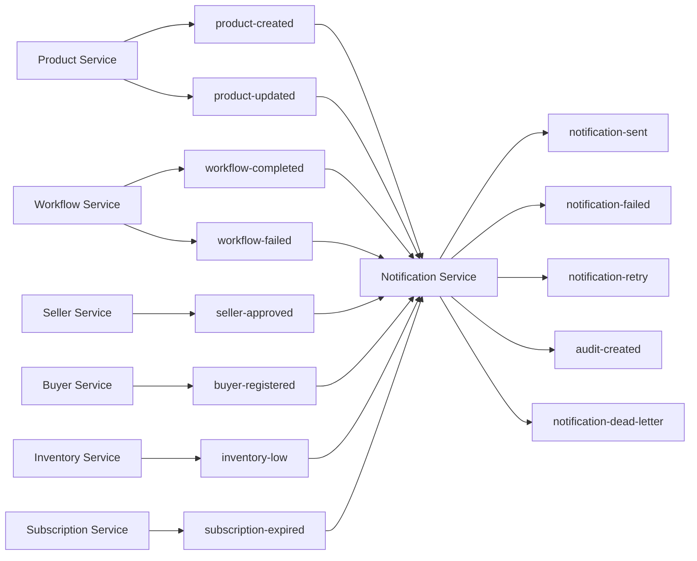
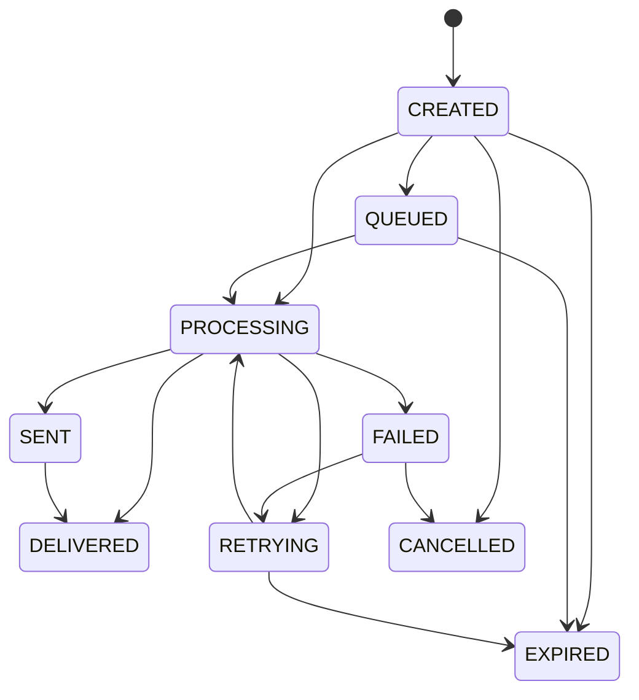

# Notification Service Architecture

## ER Diagram



## Sequence Diagram — Kafka to Delivery



## Kafka Event Flow



## Channel Providers

| Channel | Provider | Delivery Mechanism |
|---------|----------|-------------------|
| EMAIL | SMTP / SES | JavaMailSender or AWS SES SDK |
| SMS | Twilio / HTTP | Twilio SDK or REST gateway |
| PUSH | FCM / HTTP | Firebase Admin SDK or REST gateway |
| WEBHOOK | REST | HTTP POST callback |
| IN_APP | Database | `notification_inbox` table |

## Package Structure

```
controller/     REST APIs
service/        Domain services + schedulers
service.impl/   NotificationServiceImpl
provider/       Channel provider implementations
template/       Template rendering engine
channel/        Channel dispatcher
kafka/          Consumers and publishers
outbox/         Transactional outbox scheduler
audit/          Audit + history
redis/          Cache port (templates, channels, rate limits, preferences)
security/       JWT Keycloak (ADMIN, SELLER, BUYER)
```

## Status Lifecycle


