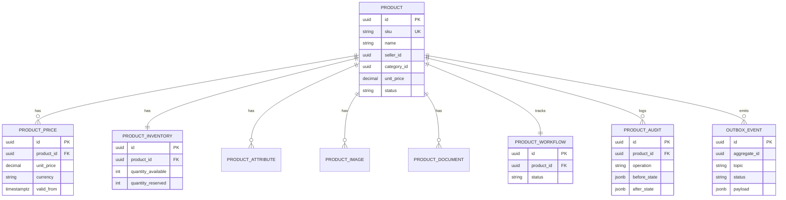
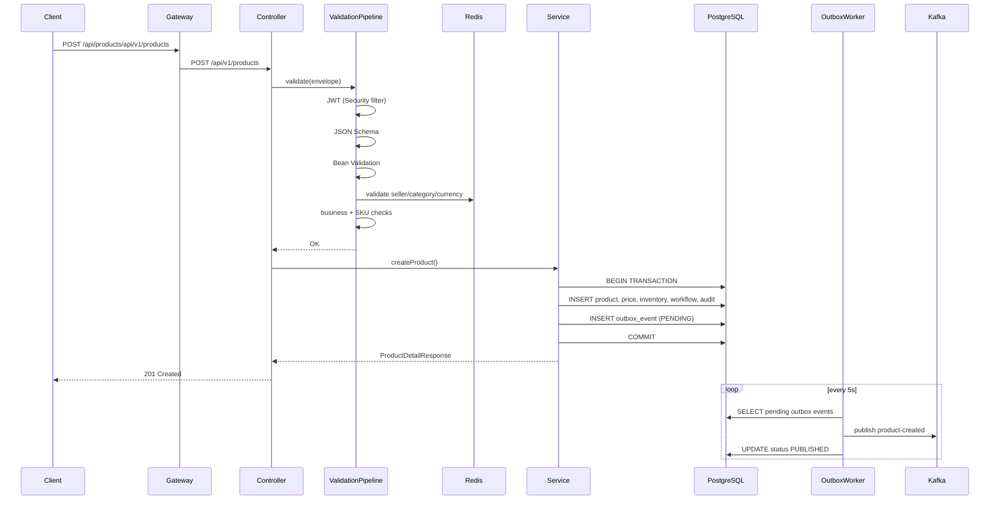

# Product Service — Architecture

## ER Diagram



## Create Product — Sequence Diagram



## Validation Pipeline

| Step | Component | Description |
|------|-----------|-------------|
| 1 | Spring Security | JWT validation (Keycloak) |
| 2 | JsonSchemaValidationStep | Classpath JSON Schema |
| 3 | BeanValidationStep | Jakarta `@Valid` |
| 4 | ReferenceValidationStep | Redis cache-aside (seller, category, currency, HSN, GST) |
| 5 | BusinessValidationStep | Price, inventory, status rules |
| 6 | DuplicateSkuValidationStep | SKU uniqueness |
| 7 | IdempotencyAspect | `Idempotency-Key` header |

## Workflow States

```
INITIAL → VALIDATING → BUSINESS_VALIDATED → PERSISTED → OUTBOX_CREATED
  → PUBLISHED → INDEXED → COMPLETED
```

Failure path: `FAILED` | Amendment: `AMENDED` | Cancel: `CANCELLED`

## Package Structure

```
productservice/
├── controller/       REST API
├── service/          Service interfaces
├── service/impl/     Business orchestration
├── validation/       Validation pipeline
├── repository/       Spring Data JPA
├── entity/           JPA entities
├── dto/canonical/    Request/response envelope
├── mapper/           MapStruct
├── kafka/            Producer & topic config
├── outbox/           Background publisher
├── config/           OpenAPI, scheduling
├── security/         JWT (via infrastructure.config)
├── enums/            Domain enums
└── constants/        Kafka topics, Redis keys
```

## Environment Variables

| Variable | Description |
|----------|-------------|
| `NEON_DB_URL` | PostgreSQL JDBC URL |
| `REDIS_HOST` | Redis host |
| `KAFKA_BOOTSTRAP_SERVERS` | Kafka brokers |
| `KEYCLOAK_ISSUER_URI` | JWT issuer |
| `MARKETPLACE_SECURITY_ENABLED` | Enable/disable JWT |
| `OUTBOX_PUBLISH_INTERVAL_MS` | Outbox poll interval |
