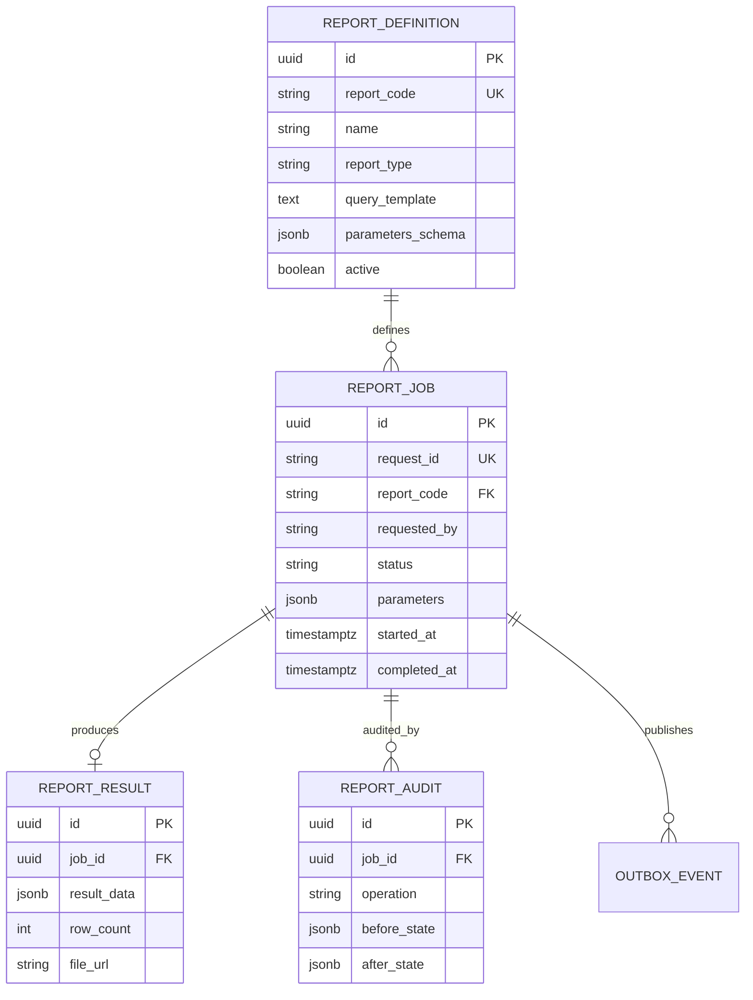
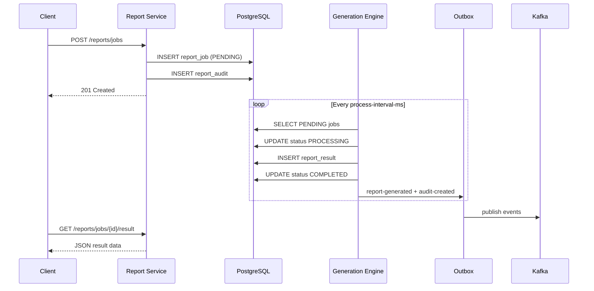
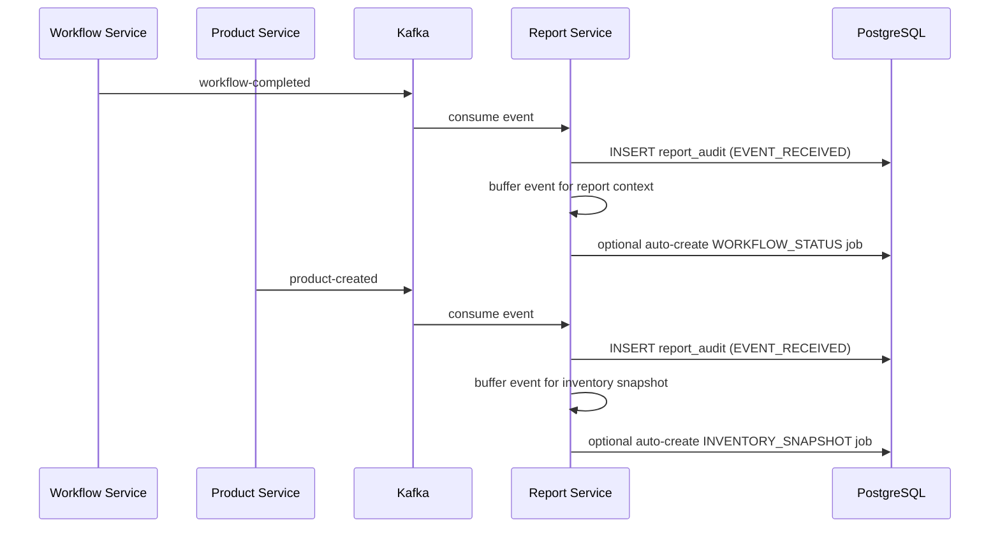

# Report Service Architecture

## ER Diagram

## Sequence Diagram — Report Generation

## Sequence Diagram — Kafka Event Ingestion

## Integration

| Source Service | Topic | Report Impact |
|----------------|-------|---------------|
| Workflow Service | `workflow-completed` | Buffers workflow metrics; may auto-trigger `WORKFLOW_STATUS` |
| Product Service | `product-created` | Buffers product events; may auto-trigger `INVENTORY_SNAPSHOT` |

Downstream consumers of `report-generated` and `audit-created` integrate via transactional outbox delivery.

## Seeded Report Definitions

| Code | Type | Description |
|------|------|-------------|
| `SALES_SUMMARY` | ANALYTICS | Revenue and order breakdown by date range |
| `WORKFLOW_STATUS` | OPERATIONAL | Workflow counts grouped by status |
| `INVENTORY_SNAPSHOT` | SNAPSHOT | Point-in-time inventory levels |

## Security

| Operation | Roles |
|-----------|-------|
| GET (read/list) | ADMIN, SELLER |
| POST (create job) | ADMIN, SELLER |
| DELETE (cancel) | ADMIN only |

Report jobs are processed asynchronously. Results are available only when job status is `COMPLETED`.
