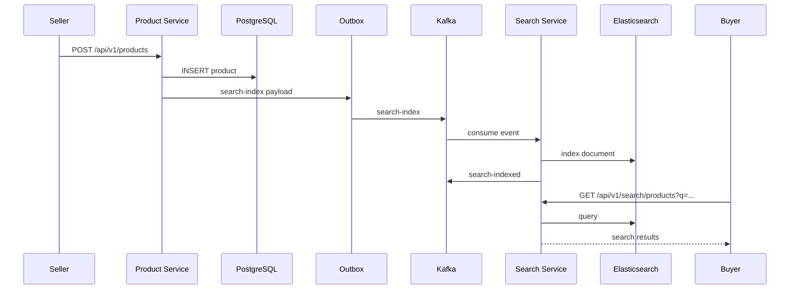
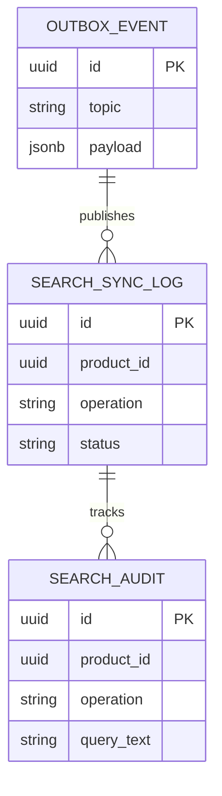
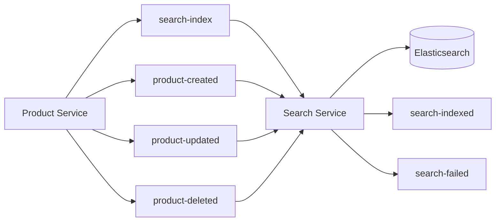

# Search Service Architecture

## End-to-End Sequence

## ER Diagram (Metadata DB)

## Elasticsearch Document

Index: `marketplace-products`

| Field | Type | Purpose |
|-------|------|---------|
| productId | keyword | Document ID |
| name | text | Full-text search |
| description | text | Full-text search |
| sku | keyword | Exact match |
| sellerId | keyword | Filter |
| categoryId | keyword | Filter |
| status | keyword | Filter |
| unitPrice | double | Range filter |

## Kafka Flow

