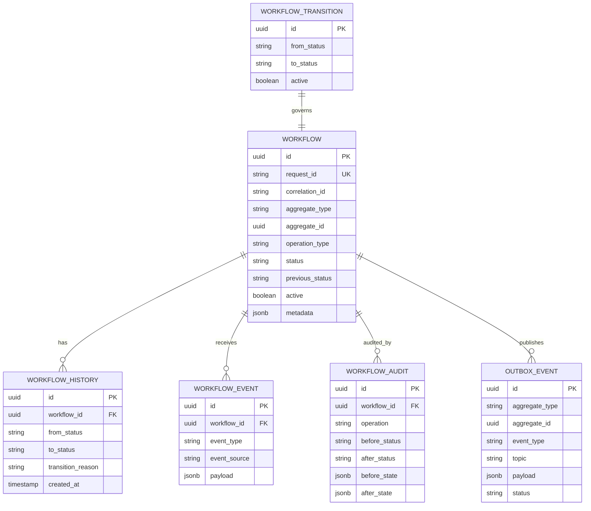
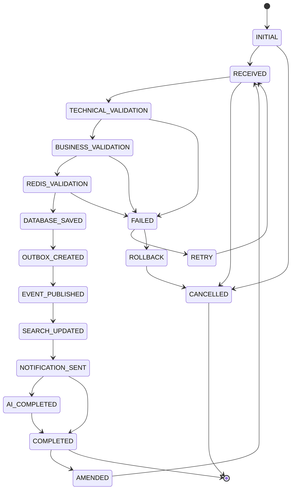
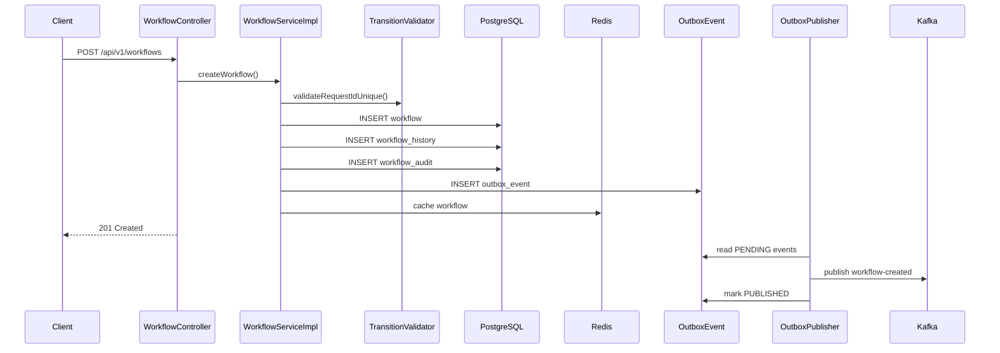
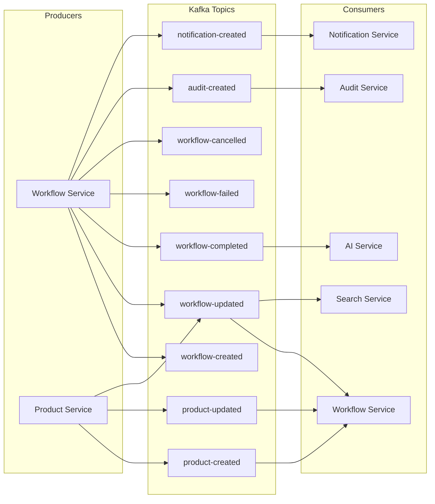

# Workflow Service Architecture

## Overview

The Workflow Service tracks the complete lifecycle of every business transaction across the Enterprise Marketplace Platform. Every microservice creates or updates workflow records via REST API or Kafka events.

## ER Diagram



## State Diagram



## Sequence Diagram — Create Workflow



## Kafka Event Flow



## Integration Points

| Service | Integration | Direction |
|---------|-------------|-----------|
| Product Service | `product-created`, `product-updated` | Kafka → Workflow |
| Audit Service | `audit-created` | Workflow → Kafka |
| Notification Service | `notification-created` | Workflow → Kafka |
| Search Service | `workflow-updated`, `workflow-completed` | Workflow → Kafka |
| AI Service | `workflow-completed` | Workflow → Kafka |

All integration is event-driven via Kafka. No cross-service database access.

## Database Diagram

```
workflow_service (Neon PostgreSQL)
├── workflow              — active workflow records
├── workflow_history      — status transition log
├── workflow_transition   — allowed transition rules (seed data)
├── workflow_event        — inbound Kafka event log
├── workflow_audit        — audit trail with before/after state
└── outbox_event          — transactional outbox for Kafka
```

## Redis Cache

| Key Pattern | Purpose | TTL |
|-------------|---------|-----|
| `workflow:{id}` | Workflow response cache | 3600s |
| `workflow:transition-rules` | Allowed status transitions | 3600s |

## Outbox Pattern

1. Workflow mutation writes `outbox_event` in same DB transaction
2. `OutboxPublisherService` polls PENDING events every 5s
3. Events published to Kafka with correlation/request headers
4. Failed publishes retry up to 5 times, then move to `workflow-dead-letter`
